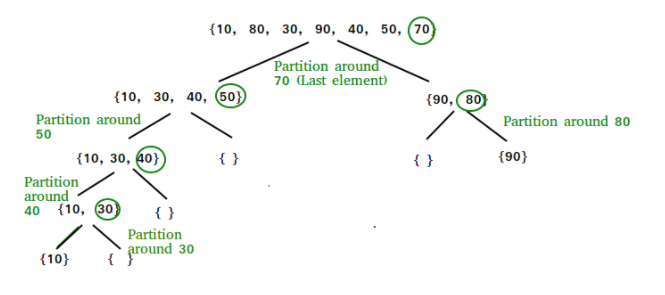

# Sorting Algorithms

## Runtimes
| Sorting Algorithm | Best       | Average    | Worst      | Stability |
| ---               | ---        | ---        | ---        | --- |
| Bubble Sort       | O(n)       | O(n^2)     | O(n^2)     | Stable |
| Selection Sort    |  O(n^2)    |  O(n^2)    |  O(n^2)    | |
| Insert Sort       | O(n)       | O(n^2)     | O(n^2)     | Stable |
| Quick Sort        | O(nlog(n)) | O(nlog(n)) | O(n^2)     | |
| Merge Sort        | O(nlog(n)) | O(nlog(n)) | O(nlog(n)) | Stable |

## Bubble Sort
Bubble Sort is arguably the simplest sorting algorithm. It works by repeatedly swapping adjacent elements that are in the wrong order, i.e. "bubbling up" large values to the end of the array.

```
[3 6 2 1] -> [3 2 1 6] -> [2 1 3 6] -> [1 2 3 6]
```
- **Best Time: Ω(n)** : This happens if the array is already sorted. It only has to run through the array one time. However, this is a sorting algorithm, so the chance the data is coming in sorted is very slim.
- **Average Time: Θ(n^2)** : This happens because of the fact that it will most likely have to run through the array n times. Since the array is length n, this means that it will be nXn or n^2
- **Worst Time: O(n^2)** : This happens because of the fact that it in it's worst case, it will have to run through the n array n amount of times. Since the array is length n, this means that it will be nXn or n^2. The worst case scenario for bubble sort is if the array comes in in reverse sorted order.

```python
n = len(arr)
# go through all array elements
for i in range(0, n-1):
    # go through all array elements left unsorted
    for j in range(0, n -i -1):
        # swap if the number is greater than the next
        if arr[j] > arr[j + 1]:
            # swap (the larger elements moves to the right)
            arr[j], arr[j+1] = arr[j+1], arr[j]
```

## Selection Sort
The selection sort is very similar to that of bubble sort. Instead of finding a max however, It repeatedly finds the minimum element from the unsorted portion, and puts it into a "sorted portion" by swapping with whatever element was there before. 

```
[3 6 2 1] -> [1 6 2 3] -> [1 2 6 3] -> [1 2 3 6] 
```
- **Best Time: Ω(n^2)** : Even if the array is already sorted, selection sort must run through its entire algorithm to figure this out.  This means it will generate an already sorted portion, and only increase it by 1 on each operation. So the total run time will still come out to be n^2
- **Average Time: Θ(n^2)** : Same with the average time. It doesn’t matter how unsorted or sorted the array is, it will run through all operations each time. Although the magnitudes of this and bubble sort are the same, this one is technically faster because it reduces the size of the search area each time, unlike bubble sort which searches the entire array each time.
- **Worst Time: O(n^2)** : Same with the worst-case time. It will use the same operations no matter how sorted or unsorted the array is. No one case is better or worse for selection sort.  

```python
n = len(arr)
# loop through all elements
for i in range(0, n-1):
    indexOfMin = i
    # find index of minimum element from unsorted
    for j in range(i+1, n-1):
        if arr[indexOfMin] > arr[j]:
            indexOfMin = j
    # swap (the lower element moves to the left)
    arr[i], arr[indexOfMin] = arr[indexOfMin], arr[i]
```


## Insertion Sort
Insertion sort works similar to that of selection sort, in that it has a sorted and unsorted portion. Instead of finding the minimum in the unsorted portion, it takes the closest number to the unsorted portion and inserts it in to the sorted portion. (Hence the name, insertion sort). To find the right place to insert it we use an "inverse bubble" sort approach. 

- **Best Time: Ω(n)** : If the array comes in sorted, it can do just one pass to figure this out. This makes it’s best case scenario, an already sorted array, run at n time.
- **Average Time: Θ(n^2)** : The average time of this is similar to that of selection sort. On average we have to search the array 1 less time each iteration. So the run time is generally around n(n-1)/2. This means that It will simplify to (n^2-n)/2 which means it will be n^2.
- **Worst Time: O(n^2)** : This is when the array is reverse sorted. The array will have to insert and swap backwards for every single number in the array, making it have to make n operations, for the n sized array. In other words n*n which is n^2.  


## Quick Sort
Quick Sort works off picking a “pivot” point. All numbers less than the pivot point go to the left, and all numbers greater than the pivot point go to the right. It then reapplies this algorithm to each side of the pivot.



Each level of this algorithm takes n amount of time. Because of the way we split up the information however, there will only be log(n) levels. This means the general run time of the algorithm is going to be the number of levels multiplied by n, or nlogn.

- **Best Time: Ω(nlogn)** : The best case in this scenario is if we pick a perfect pivot point to split the data. It doesn't matter if the array comes in sorted or not. The pivot point is what matters the most. If we pick a pivot point that perfectly splits the data each time, then we will have log(n) levels, and therefore the nlogn run time. 
- **Average Time: Θ(nlogn)** : The average time happens when we choose a decent pivot point. As long as we can split up the data and let the program divide and conquer, we get an nlogn time.  
- **Worst Time: O(n^2)** : The worst-case scenario happens when we choose a bad pivot point. Instead of dividing the work up to log(n), we keep only splitting out 1 number each time. (The number is larger or smaller than the rest of the array). This makes it so we have roughly n levels. Therefore we end up having the n X n relationship, instead of the n X logn relationship.     

## Merge Sort
Merge sort is one of the fastest comparison sorts. It runs at nlogn for all run times, making it reliably fast at splitting up and sorting data. It works by dividing up the data in to smaller and smaller chunks. It then recombines them in to a sorted algorithm. The array breaks down the data until it is in single unit subarrays. It then recombines them using cursors that only have touch each element once for each combination. So each level is going to be at most n amount of “touches”. Because of the way it breaks up the algorithm, it has logn amount of levels.

This means that is will always run at nlogn timing, as there is no way to break it up worse than logn levels.  So it will be n amount of touches per level multiple by logn amount of levels, giving us an even nlogn no matter what array comes in. 

- **Best Time: Ω(nlogn)** : The same algorithm is applied no matter what type of array comes in. This means it will always be nlogn
- **Average Time: Θ(nlogn)** : The same algorithm is applied no matter what type of array comes in. This means it will always be nlogn
- **Worst Time: O(nlogn)** The same algorithm is applied no matter what type of array comes in. This means it will always be nlogn

## Stability
For a sorting algorithm to be "stable" it must preserver the original order of elements that are considered equal in value. For numeric values this doesnt pose a problem but for instance when sorting a deck or cards which has a value and a suit you may wish to keep the original ordering of all cards with value 6.

- **Bubble Sort**: Stable – This algorithm is stable because it just swaps the largest value up the structure to the top. If two objects are the same, no swap takes place. This means equal values that were to the left will stay to the left.  (2a 1 2b) -> (1 2a 2b) (The 2a will never swap with the 2b because swaps don’t take place when two values are equal)  

- **Selection Sort**: Nonstable – By default selection sort isn’t stable. This is because it takes a number and swaps it to the left “sorted” side. This gives the possibility that a number can be swapped behind another equal number.  (2a 2b 1) -> (1 2b 2a) (The 2a was swapped with the lowest number 1 which was on the right side of 2b. The swap takes place, and the order is not preserved)  

- **Insertion Sort**: Stable – Insertion sort uses a similar swapping mechanism as Bubble sort. It starts from the right while swapping, but never swaps equal values, meaning there is never a chance for elements positions to be flipped.  

- **Quick Sort**: Nonstable – Quick sort uses a splitting mechanism to order to sort. If this “pivot” is a number which has a duplicate, there is a good chance the order will be broken.  (2a 2b 1) -> (1 2b 2a) (In this scenario, 2b was chosen as the pivot, anything less than it went to the left, and anything greater than  or equal went to the right. 2a is equal so it went to the right, breaking the stability of the algorithm)  

- **Merge Sort**: Stable – Merge Sort splits up the data and recombines it in a way that grabs the smallest element and sticks it back in to the array. It however adheres to the order of values, giving preference to values that are in the left subarray to maintain order.  